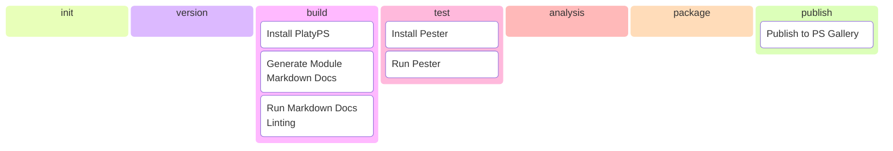

# ZeroFailed.Build.PowerShell

  
  
  
  

A [ZeroFailed](https://github.com/zerofailed/ZeroFailed) extension containing features that support build processes for PowerShell projects.

## Overview

| Component Type | Included | Notes                                                                                                                                                         |
| -------------- | -------- | ------------------------------------------------------------------------------------------------------------------------------------------------------------- |
| Tasks          | yes      |                                                                                                                                                               |
| Functions      | no       |                                                                                                                                                               |
| Processes      | no       | Designed to be compatible with the default process provided by the [ZeroFailed.Build.Common](https://github.com/zerofailed/ZeroFailed.Build.Common) extension |

For more information about the different component types, please refer to the [ZeroFailed documentation](https://github.com/zerofailed/ZeroFailed/blob/main/README.md#extensions).

This extension consists of the following feature groups, refer to the [HELP page](./HELP.md) for more details.

- Testing using `Pester`
- Publishing modules to PowerShell repositories (e.g. PSGallery)

The diagram below shows the discrete features and when they run as part of the default build process provided by [ZeroFailed.Build.Common](https://github.com/zerofailed/ZeroFailed.Build.Common).

## Pre-Requisites

Using this extension requires no other components to be already installed.

## Dependencies

| Extension                                                                          | Reference Type | Version |
| ---------------------------------------------------------------------------------- | -------------- | ------- |
| [ZeroFailed.Build.Common](https://github.com/zerofailed/ZeroFailed.Build.Common)   | git            | `main`  |
| [ZeroFailed.DevOps.Common](https://github.com/zerofailed/ZeroFailed.DevOps.Common) | git            | `main`  |
